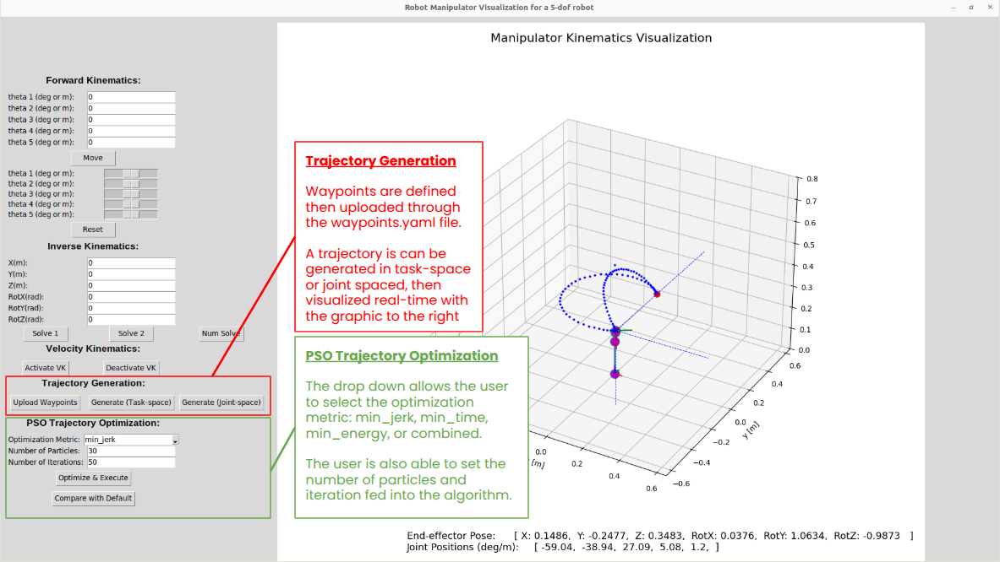

# Trajectory Planning Particle Swarm Optimization

This is a FunRobo final project focusing on replicating novel algorithms from a research paper. Specifically, we will be looking at these papers for reference:

1. [**Trajectory Planning of Robotic Arm Based on Particle Swarm Optimization Algorithm**](https://www.mdpi.com/2076-3417/14/18/8234), 2024  
2. [**Time-optimal Trajectory Planning of Dulcimer Music Robot Based on PSO Algorithm**](https://ieeexplore.ieee.org/document/9164017), 2020

The first paper focuses on enhancing the motion stability and efficiency of industrial robotic arms through improved trajectory planning with a Particle Swarm Optimization (PSO) algorithm. The Robot Trajectory Planning Particle Swarm Optimization (RTPPSO) algorithm incorporates adaptive weight strategies and random perturbation terms to address the common issue of PSO algorithms getting trapped in local optima. The RTPPSO algorithm is applied to optimize the parameters of an S-shaped velocity profile for the robotic arm's movement. Simulation experiments demonstrate that this approach significantly improves the acceleration and overall motion smoothness of the robotic arm, surpassing traditional trial-and-error velocity planning methods.


The second paper presents a time-optimal trajectory planning method for a dulcimer music robot using an improved Particle Swarm Optimization (PSO) algorithm. The goal is to enable fast and stable striking motions essential for playing the dulcimer by minimizing the total trajectory execution time while adhering to all kinematic constraints, including joint angles, velocities, and accelerations. The authors develop a kinematic model of the robot using the Denavit-Hartenberg (D-H) method and apply fifth-order polynomial interpolation for trajectory planning. The improved PSO algorithm is tailored to handle the full set of constraints, and simulations show that it significantly reduces trajectory time—by 74.35 percent—while maintaining smooth and continuous motion profiles, validating the algorithm's effectiveness.

## Results
To read more about the project and results, check out our writeup and demo: 
- [Report](PSO_Trajectory_Optimization.pdf)
- [Demo Video 1](https://drive.google.com/file/d/1YdwvggKLrmf1WGced5zTqtRC5swXWiTm/view?resourcekey)
- [Demo Video 2 ](https://www.youtube.com/watch?v=XTrC-QfKDEs)

## Running the Simulator
### How to Run

- Run the main script with the command below:
``` bash
$ python main_arm.py 
# default configures the two-DOF arm
```

- There are options to pass command-line arguments to configure the viz tool to other arm configurations, i.e., SCARA and 5-DOF arm

``` bash
$ python main_arm.py -h

usage: main_arm.py [-h] [--robot_type ROBOT_TYPE] 

options:
  -h, --help            show this help message and exit
  --robot_type ROBOT_TYPE
                        insert robot type, e.g., '2-dof', 'scara', '5-dof'
```
- Example, for the robot used for optimization:
```bash
$ python main_arm.py --robot_type 5-dof
```

### Usage Guide


In addition, when you click **“Compare with Default**, the tool automatically generates side‑by‑side plots—both **raw and normalised**—of position, velocity and acceleration for every joint, and saves them in `trajectory_plots/<metric>_<timestamp>/` for easy inspection.
